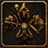

<p align="center">
  
</p>

<h1 align="center">GroupScape Tracker Plugin</h1>

<p align="center">
  Setup and web dashboard: <a href="https://groupscape.online/">groupscape.online</a>
</p>

<p align="center">
  A RuneLite plugin for OSRS groups — clans, group ironmen, and friend groups.
</p>

<p align="center">
  <a href="./LICENSE"></a>
</p>

Ever wished RuneScape had the party system you know from other MMOs?

Now it does. 🎮

GroupScape — RuneScape, but better with friends.

## What it does

This plugin tracks information about your RuneScape group's players and streams it to a group-scoped server, where you and your other group members can view it on a live, OSRS-themed dashboard. Currently it tracks:

* Inventory, equipment, bank, rune pouch, seed vault, potion storage, and shared bank
* Skill XP
* World position, viewable in an interactive map
* HP, prayer, energy, and world
* Quest completion status
* Health and position of NPCs the player is interacting with
* Achievement diaries
* Collection log

## Setup

Each group member that you want to track needs to install the plugin. One person creates a group on the webapp; the credentials it provides are shared with the rest of the group.

## Dev setup

Requires a JDK 11+ toolchain.

```sh
./gradlew build
./gradlew run
```

## Sources

Source for the paired server/webapp: [groupscape-web](../groupscape-web)

## License

[BSD 2-Clause](./LICENSE)
